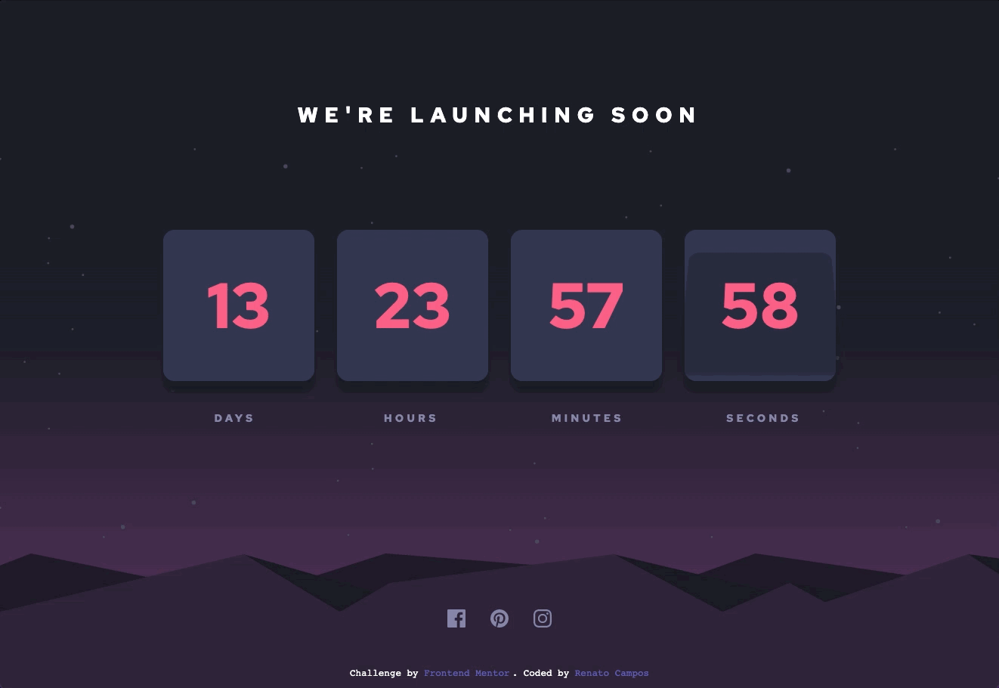
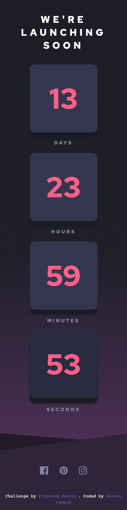

# Frontend Mentor - Launch countdown timer solution

This is a solution to the [Launch countdown timer challenge on Frontend Mentor](https://www.frontendmentor.io/challenges/launch-countdown-timer-N0XkGfyz-). 

## Table of contents

- [Overview](#overview)
  - [The challenge](#the-challenge)
  - [Screenshot](#screenshot)
  - [Links](#links)
- [My process](#my-process)
  - [Built with](#built-with)
- [Author](#author)

## Overview

### The challenge

Users should be able to:

- See hover states for all interactive elements on the page
- See a live countdown timer that ticks down every second (start the count at 14 days)
- **Bonus**: When a number changes, make the card flip from the middle

### Screenshot

### Links

- Solution URL: [Github](https://github.com/RenatoDourad0/Courses/tree/master/frontend_mentor/launch-countdown-timer-main)

## My process

### Built with

- Semantic HTML5 markup
- CSS animations
- CSS Flexbox
- Vanilla JS (clock logic)
- event handling / DOM manipulation
- Sass

## Author
  
  Renato Campos
- [GitHub](https://github.com/RenatoDourad0)
- [Linkedin](www.linkedin.com/in/renato-dourado-b1b301112)

